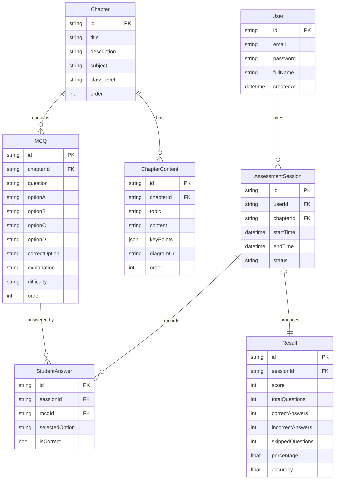

# Database Schema Diagram
## Alfanumrik – Chapter Learning & Assessment Module

## Table Descriptions

| Table | Purpose |
|---|---|
| User | Stores student accounts with hashed passwords |
| Chapter | Stores chapter metadata — title, subject, class |
| ChapterContent | Stores topic-wise study content per chapter |
| MCQ | Stores all questions with options and correct answers |
| AssessmentSession | Tracks each exam attempt by a student |
| StudentAnswer | Records each answer selected during an assessment |
| Result | Stores final computed score and statistics |

## Key Relationships

- One **User** can have many **AssessmentSessions**
- One **Chapter** has many **ChapterContent** records (one per topic)
- One **Chapter** has many **MCQs**
- One **AssessmentSession** belongs to one **User** and one **Chapter**
- One **AssessmentSession** has many **StudentAnswers**
- One **AssessmentSession** produces exactly one **Result**
- One **MCQ** can appear in many **StudentAnswers** (across different sessions)
